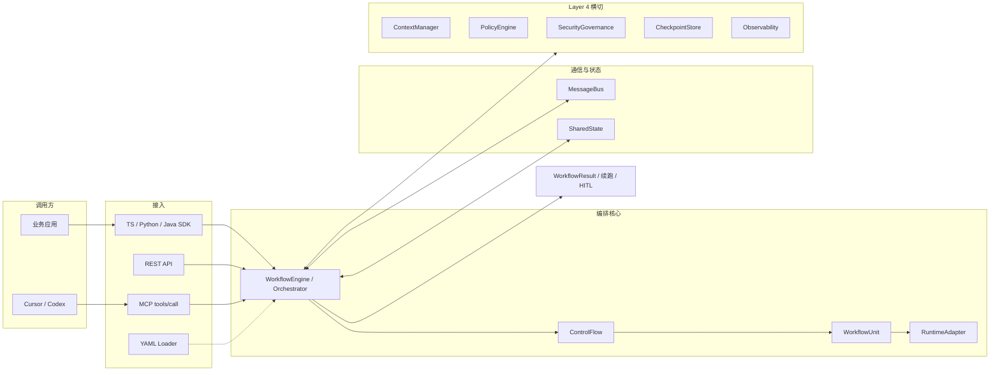

# 四层架构

| 层 | 职责 | 主要类型 |
|----|------|----------|
| **L1** Unit + RuntimeAdapter | 原子 Agent 执行，框架无关 | `WorkflowUnit`, `createMockAdapter`, … |
| **L2** ControlFlow | 调度策略 | `Sequential` / `Loop` / `Router` / `DAG` / … |
| **L3** Bus + SharedState | 通信与状态（含作用域） | `createMessageBus`, `createSharedState` |
| **L4** Infrastructure | 记忆、断点、策略、安全、观测 | Context / Checkpoint / Policy / Security / OTel |

## 系统全景

### 阶段说明

| 阶段 | 输入 | 谁决策 | 产出 |
|------|------|--------|------|
| 接入 | 任务 / YAML / MCP | SDK 或网关 | 一次 `run` |
| 编排 | SharedState | ControlFlow.`next()` | 下一批 Unit |
| 执行 | AgentInput + Context | RuntimeAdapter | AgentOutput |
| 横切 | 用量 / 风险 / 记忆 | Layer 4 | 快照、审计、指标 |
| 收口 | 完成或暂停 | Engine | Result / HITL / Resume |

## 理论长文

仓库内：[`Agent统一工作流模式设计.md`](https://github.com/OWNER/Uni-Flow/blob/main/Agent统一工作流模式设计.md)（索引见 [OpenSpec 与设计长文](../reference/openspec-index.md)）。
