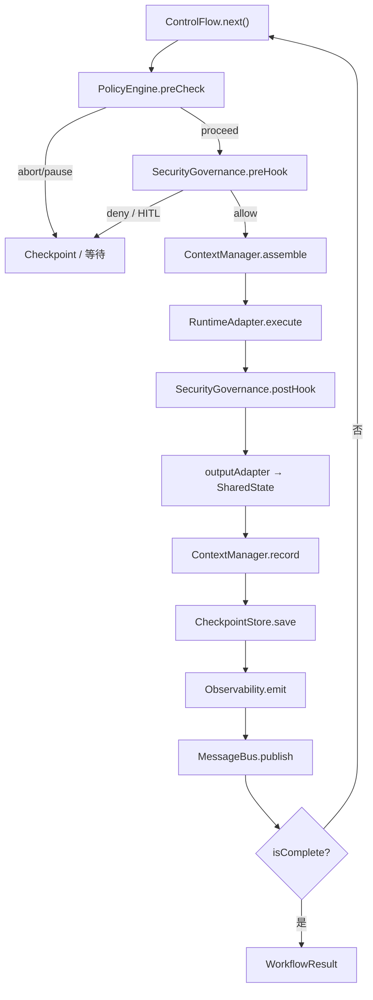

# 执行管线

单次 Unit 的钩子顺序与 `DefaultWorkflowEngine` 一致。

## 管线顺序

**Policy → Security → Context → Execute → post-hooks → record → checkpoint → observability → MessageBus**



ASCII 摘要：

```
Caller → SDK|REST|MCP|YAML → Engine
  ↻ ControlFlow.next()
      Policy → Security → Context → Adapter.execute
      → State → Record → Checkpoint → Obs → Bus
  → Result | Resume | HITL
```

## Layer 4 可选注入

```typescript
createWorkflowEngine(config, {
  contextManager: createEnhancedContextManager({
    vectorStore: createVectorStore('memory'),
    longTermMemory: createLongTermMemoryStore(),
  }),
  checkpointStore: createRedisCheckpointStore(new InMemoryRedisClient()),
  policyEngine: createPolicyEngine({ /* … */ }),
  security: createFullSecurityGovernance({ blockInjection: true }),
  observability: createOpenTelemetryObservability(),
});
```

| 组件 | 作用 |
|------|------|
| ContextManager | 工作 / 会话 / 长期 / 向量记忆 |
| CheckpointStore | 快照与 `resume` |
| PolicyEngine | 重试、超时、预算、熔断 |
| SecurityGovernance | 鉴权、工具策略、PII、注入、HITL |
| Observability | Span / Metrics / Cost |
