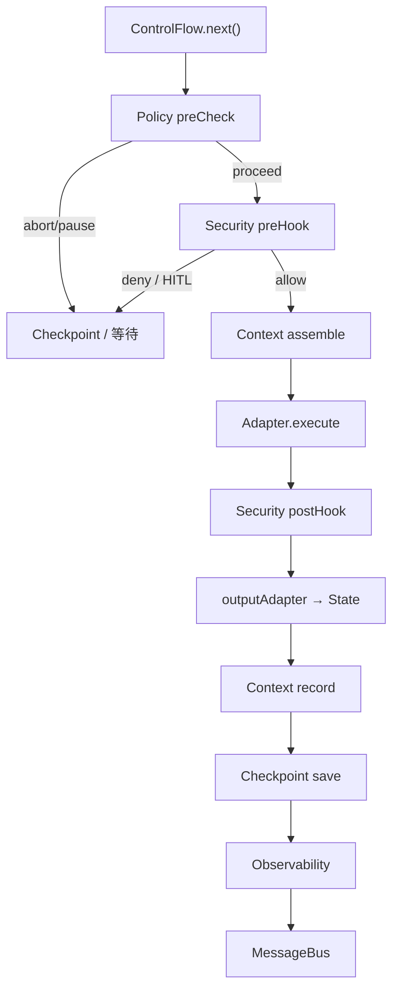

# Layer4 为何存在

记账场景里，除了「分流对不对」，你还会关心：

- 一天 Token 预算会不会烧穿  
- 敏感操作要不要人工点头（HITL）  
- 跑到一半挂了能否续跑  
- 要不要记住用户上周的记账习惯  

这些若复制进每个 Agent，会炸。Layer4 把它们做成**统一管线钩子**。

## 管线顺序（与引擎一致）

| 组件 | 设计理由 | 仓库现状 |
|------|----------|----------|
| Policy | 重试 / 超时 / 预算 | ✅ `createPolicyEngine` |
| Security | 鉴权、工具策略、注入、HITL | ✅ 基础 + `createFullSecurityGovernance` |
| Context | 工作/会话/长期/向量记忆 | ✅ 内存；向量等 🟡 需配置 |
| Checkpoint | 快照与 resume | ✅ 内存；Redis 🟡 可选 |
| Observability | Span / 指标 | ✅；OTel 🟡 可选依赖 |

## 若你只记住一件事

**横切走管线，不走进每个记账 Prompt。** 用不到的组件可以不挂。
