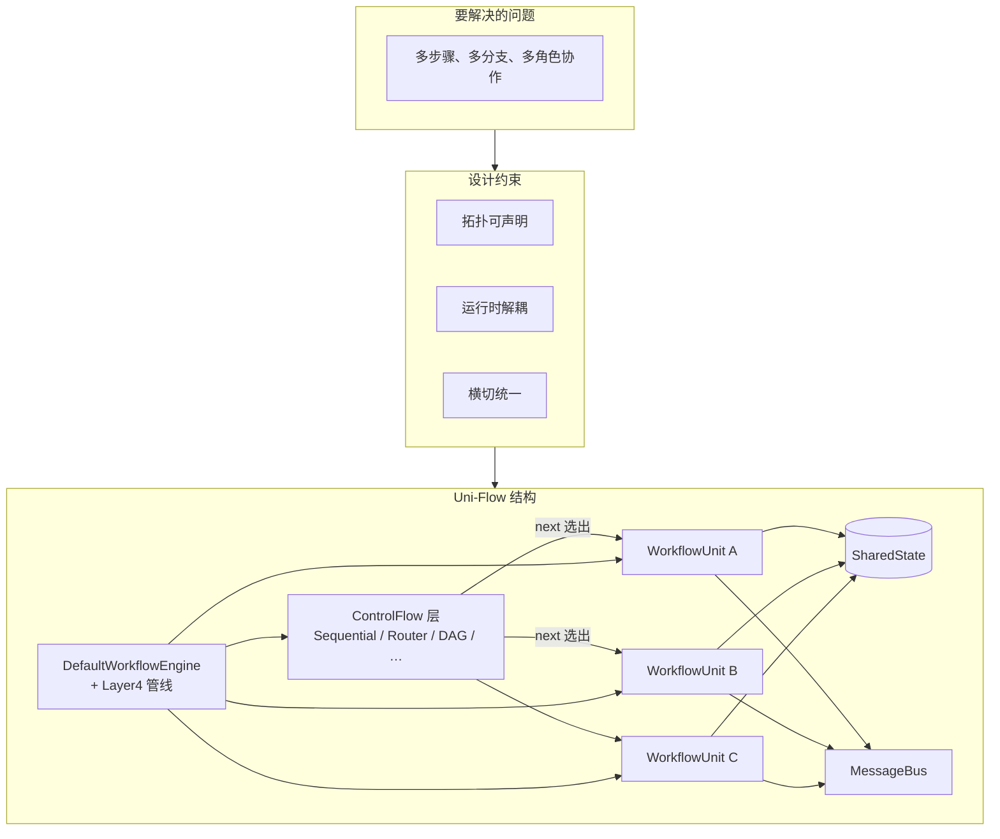
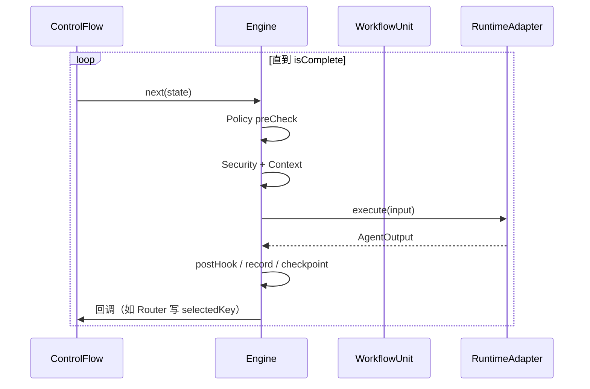

# 两层模型

本文用「问题 → 约束 → 结构」论证链说明 Uni-Flow 的核心形状：**外层 ControlFlow 管宏观排班，内层 WorkflowUnit 管微观执行。** 读完应能向同事解释这两层各自职责，且不会把 Think/Execute/Observe 误当成系统顶层。

## 问题：多 Agent 协作为什么难

当一条业务链路需要多个智能体（或智能体 + 工具 + 人工审核）时，团队通常遇到：

| 症状 | 根因 |
|------|------|
| 加一条支路要改多处代码 | 路由与业务逻辑耦合 |
| 预算、鉴权、记忆各写一遍 | 缺少横切管线 |
| 拓扑只存在于某人脑子里 | 没有可校验的声明式配置 |
| 换模型要动调度代码 | 编排与运行时未解耦 |

这些问题指向的不是「再写一个 Agent 类」，而是**编排基础设施**。

## 约束：设计必须满足什么

从仓库实践与 OpenSpec 约束归纳五条：

1. **拓扑属于 YAML** — `units` + `flow` 是可 diff、可 validate 的真源。
2. **新能力走 `uses` 插件** — 领域智能不进引擎 `switch`。
3. **禁止第二套手写调度器** — 不用业务 `for`/`while` 替代 ControlFlow。
4. **Unit 不感知宏观流类型** — Router 与 Sequential 对 Unit 透明（控制流反转）。
5. **横切走统一管线** — Policy、Security、Context 等不复制进每个 Prompt。

## 结构：两层 + 通信底座



### 外层：ControlFlow（宏观排班）

ControlFlow 回答：**在当前 SharedState 下，下一步执行哪些 Unit？工作流是否结束？**

```typescript
interface ControlFlow {
  next(state: SharedState, completed: Set<UnitId>): WorkflowUnit[];
  isComplete(state: SharedState): boolean;
}
```

七种实现覆盖常见拓扑：Sequential、Parallel、Router、DAG、Loop、Delegation、Composite。YAML `flow.type` 映射到对应实现，见 [ControlFlow 模块](/architecture/modules/control-flow)。

**Router 示例（中性表述）：** 上游分类 Unit 产出路由键 → ControlFlow 根据 `routes` 映射选中 handler Unit。路由是**流层**行为，不是 handler 内部的隐藏分支。

### 内层：WorkflowUnit（微观执行）

WorkflowUnit 是**可调度原子**：从 State 取输入，调用 RuntimeAdapter 执行，把输出写回 State。

```text
WorkflowUnit
  ├── inputAdapter(state, context) → AgentInput
  ├── runtime.execute(input) → AgentOutput   ← 微观：可能 ReAct、可能单次调用
  ├── outputAdapter(output, state)
  └── terminationPolicy
```

**关键认知：** ReAct（推理 → 行动 → 观测）发生在 `runtime.execute` **内部**，不是 Uni-Flow 顶层阶段。顶层每次 tick 是「执行一个或多个完整 Unit」，见 [模式抗性](/why/resilience)。

### 底座：SharedState + MessageBus

| 组件 | 职责 |
|------|------|
| **SharedState** | Unit 间共享的键值快照；Router 选中键、输出字段、HITL 状态等 |
| **MessageBus** |  steering / followUp / unit-output / checkpoint 等事件，供观测与集成 |

## 一次请求的生命周期（简图）



## 与「模式名词」的关系

| 你听到的模式 | 在两层模型中的位置 |
|--------------|-------------------|
| Router | ControlFlow = RouterFlow |
| ReAct | Unit 内 Adapter 循环 |
| Plan-and-Execute | DAG 或 Sequential 多 Unit |
| Multi-Agent | Parallel 或 Delegation |
| HITL | Layer4 Security + Checkpoint 暂停 |

模式是**组合**，不是另一套架构。完整映射见 [设计附录](/architecture/design-appendix)。

## 代码与配置入口

| 入口 | 用途 |
|------|------|
| `createEngineFromYaml` | 从 YAML 构建 Engine（推荐） |
| `createWorkflowEngine` | 代码构图（测试、Composite 边角） |
| `examples/templates/` | 可改模板 |
| `schemas/uniflow.workflow.schema.json` | 校验规则 |

## 若你只记住一件事

**外层 ControlFlow 选 Unit，内层 Adapter 干活；ReAct 在箱内，不在屋顶。** 下一节看每次「干活」前后引擎走什么管线：[执行管线与 Layer4](/architecture/pipeline)。
