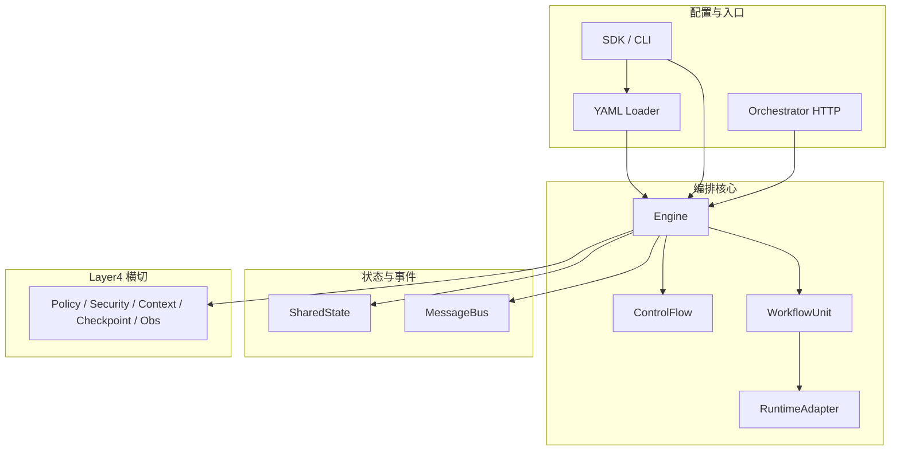

# 模块地图

Uni-Flow 按职责拆成可组合模块。本页是索引；每个模块有独立的 **What / Who / Why / How** 说明与仓库成熟度标注。

**图例：** ✅ 生产可用 · 🟡 演示级 / 需自备后端或领域实现 · ⬜ 约定或预留

## 架构分层一览

## 模块索引

| 模块 | What（是什么） | 状态 | 详情 |
|------|----------------|------|------|
| [WorkflowUnit](/architecture/modules/workflow-unit) | 可调度原子：adapters + termination + runtime | ✅ | 内层执行边界 |
| [RuntimeAdapter](/architecture/modules/runtime-adapter) | 连接 pi-agent-core / Mock / 自建运行时 | ✅ | 运行时解耦 |
| [ControlFlow](/architecture/modules/control-flow) | 宏观排班：七种流类型 | ✅ | 外层拓扑 |
| [SharedState](/architecture/modules/shared-state) | Unit 间共享键值状态 | ✅ | 路由键与输出 |
| [MessageBus](/architecture/modules/message-bus) | 异步事件：steer、HITL、checkpoint | ✅ | 集成与观测 |
| [Engine](/architecture/modules/engine) | 驱动 ControlFlow + 执行管线 | ✅ | 运行时心脏 |
| [Layer4](/architecture/modules/layer4) | Policy / Security / Context / Checkpoint / Obs | ✅ / 🟡 | 生产横切 |
| [YAML Loader](/architecture/modules/yaml-loader) | 解析 YAML → Engine | ✅ | 拓扑真源 |
| [Orchestrator](/architecture/modules/orchestrator) | HTTP 服务：from-yaml、runs、resume | ✅ / 🟡 | 跨进程运维 |
| [SDK 与 CLI](/architecture/modules/sdk-cli) | TS / Python / Java SDK + `uniflow` CLI | ✅ / 🟡 | 开发者入口 |

## 推荐阅读顺序

1. [WorkflowUnit](/architecture/modules/workflow-unit) + [ControlFlow](/architecture/modules/control-flow) — 理解两层。
2. [Engine](/architecture/modules/engine) + [Layer4](/architecture/modules/layer4) — 理解管线。
3. [YAML Loader](/architecture/modules/yaml-loader) + [SDK 与 CLI](/architecture/modules/sdk-cli) — 上手改配置。
4. [Orchestrator](/architecture/modules/orchestrator) — 部署与跨语言。

## 与 API 文档的关系

| 类型 | 路径 |
|------|------|
| 概念与 3W（本区） | `/architecture/modules/*` |
| 手写 API 手册 | `/reference/*` |
| TypeDoc 生成附录 | `/reference/generated/` |

## 若你只记住一件事

**先读 Unit + ControlFlow，再读 Engine + Layer4；配置从 YAML Loader 进，运维从 Orchestrator 出。**
