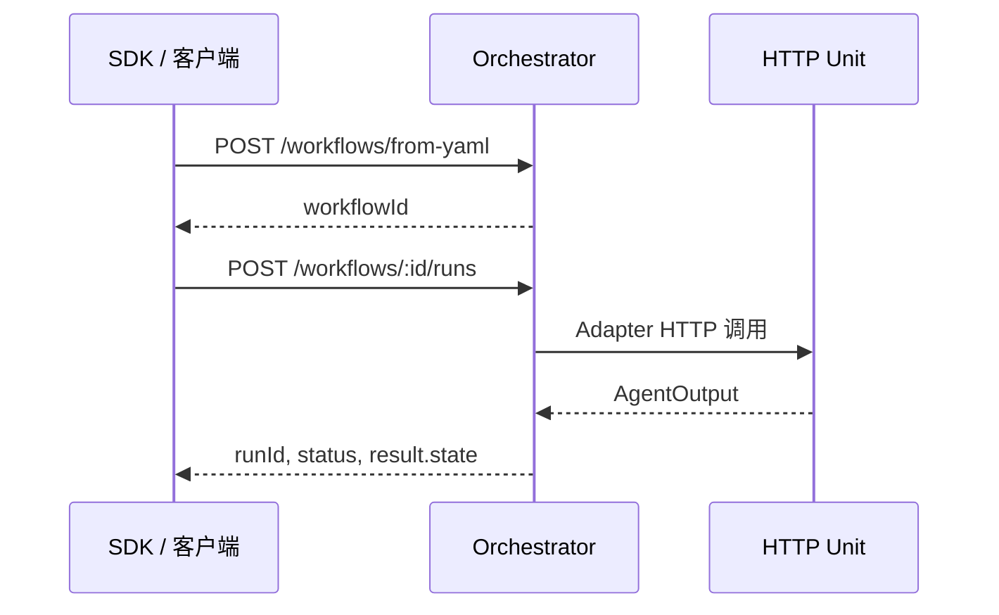

# Orchestrator

## What（是什么）

Orchestrator 是 Uni-Flow 的 **HTTP 进程入口**：加载 YAML、注册 bindings、启动与查询 run、处理 resume 与 HITL，使编排能力可跨语言、跨服务调用。

核心路由（详见 [HTTP 参考](/reference/http/)）：

| 方法 | 路径 | 用途 |
|------|------|------|
| GET | `/health` | 健康检查 |
| POST | `/workflows/from-yaml` | 注册工作流 |
| POST | `/workflows/:id/runs` | 启动 run |
| GET | `/workflows/:id/runs/:runId` | 查询状态与结果 |
| POST | `.../resume` | 从 checkpoint 恢复 |
| POST | `.../hitl` | 人工审批响应 |

远程 Unit 请求体遵循 `docs/remote-unit-http-contract.md`。

## Who（谁在用）

- 运维部署统一编排服务的团队
- Python / Java 业务服务（只调 HTTP，不嵌 TS Engine）
- 需要集中管理 bindings 与密钥的平台组

## Why（为什么需要）

| 若没有 Orchestrator | 后果 |
|-------------------|------|
| 每语言嵌一份 Engine | 绑定与注册语义分裂 |
| HTTP Unit 无统一注册点 | 跨语言拓扑难运维 |
| run 无中心查询 | 客户端无法轮询 `runId` |

Orchestrator 把 **进程内 Engine** 升级为 **服务化编排核**，与 SDK 完整面配套。

## How（怎么用）

**典型流程：**

**注意：** Orchestrator 注册表在进程内；重启后需重新 `from-yaml`（YAML 文件仍在磁盘）。

## 仓库现状

| 项 | 状态 |
|----|------|
| HTTP Server | ✅ `src/orchestrator/server.ts` |
| from-yaml + bindings | ✅ |
| run / resume / hitl | ✅ |
| MCP 等扩展路由 | 🟡 见 API 手册 |
| 多实例会话粘滞 | 🟡 生产需自备负载与存储 |

## 相关链接

- [SDK 与 CLI](/architecture/modules/sdk-cli)
- [跨语言指南](/guide/cross-lang)
- [HTTP 参考总览](/reference/http/)

## 若你只记住一件事

**Orchestrator 让 YAML 拓扑变成服务；bindings 把远程 Unit 接进同一张图。**
