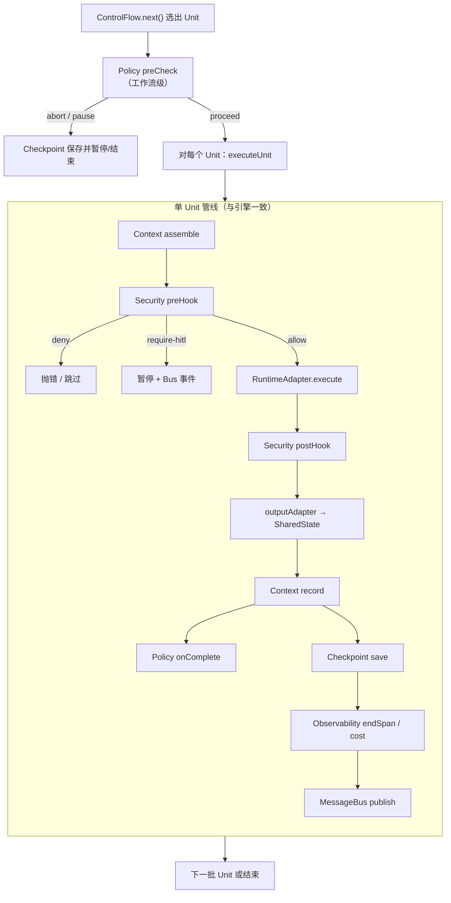

# 执行管线与 Layer4

每个 WorkflowUnit 被调度执行时，`DefaultWorkflowEngine` 会走**固定顺序**的横切钩子。顺序与实现一致，便于你对照源码排障，也便于回答「若没有这一层会怎样」。

## 总览图

> **说明：** 工作流级 `Policy.preCheck` 在 `executeLoop` 每轮开头执行；单 Unit 级重试/超时由 `executeUnit` 内 `Policy` 与 `unit.policyOverrides` 处理。

## 阶段详解与反事实

以下用「若没有会怎样」说明 Layer4 存在的理由，而非罗列功能清单。

### Policy（策略引擎）

**做什么：** 执行前检查预算/超时；执行后 `onComplete`；出错时 `onError` 决定重试、跳过或失败。

| 若没有 | 后果 |
|--------|------|
| 无 preCheck | Token 烧穿后仍继续调模型，账单失控 |
| 无 onError 重试 | 瞬时网络抖动导致整图失败 |
| 无 per-unit 超时 | 某个 Adapter 挂死拖住整次 run |

**仓库现状：** ✅ `createPolicyEngine`（`src/layer4/`）

### Security（安全治理）

**做什么：** `preHook` 鉴权、工具策略、注入检测；`require-hitl` 触发人工审批；`postHook` 净化输出。

| 若没有 | 后果 |
|--------|------|
| 无 caller 鉴权 | 任意调用敏感 Unit |
| 无工具策略 | Agent 可调用未授权 API |
| 无 HITL | 高风险操作无法暂停等人点头 |

**仓库现状：** ✅ 基础 + `createFullSecurityGovernance`

### Context（上下文管理）

**做什么：** `assemble` 按 `contextPolicy` 拉取工作/会话/长期记忆；`record` 在 Unit 完成后写入。

| 若没有 | 后果 |
|--------|------|
| 无 assemble | 每个 Unit 自己拼历史，Prompt 膨胀且不一致 |
| 无 record | 多轮对话断片，恢复后失忆 |

**仓库现状：** ✅ 内存实现；向量检索等 🟡 需配置后端

### Execute（RuntimeAdapter）

**做什么：** 真正调用模型/图/确定性逻辑。不属于 Layer4，但是管线核心步骤。

| 若没有 Adapter 抽象 | 后果 |
|---------------------|------|
| 引擎绑死单一 SDK | 换 LangGraph / 远程服务要改引擎 |

**仓库现状：** ✅ `RuntimeAdapter` + Mock（见 [RuntimeAdapter 模块](/architecture/modules/runtime-adapter)）

### post-hook 与 State 回写

**做什么：** `security.postHook` → `outputAdapter` 写入 SharedState。

| 若没有 outputAdapter 纪律 | 后果 |
|---------------------------|------|
| Unit 直接改全局 | Router 无法根据约定键路由，测试不可复现 |

### Context record

**做什么：** 把本轮 input/output 记入记忆后端，供后续 Unit `assemble`。

### Checkpoint（检查点）

**做什么：** 序列化 SharedState、ControlFlow 游标、已完成 Unit、Bus 历史；支持 `resume`。

| 若没有 | 后果 |
|--------|------|
| 进程崩溃 | 从头重跑，重复计费、重复副作用 |
| 无 HITL 快照 | 审批后无法从断点继续 |

**仓库现状：** ✅ 内存；Redis 等 🟡 可选

### Observability（可观测）

**做什么：** Span、日志、成本指标；与 `traceId` 贯穿 Unit。

| 若没有 | 后果 |
|--------|------|
| 无 span | 多 Unit 并行时无法定位慢在哪 |
| 无 cost 聚合 | 财务对账只能靠猜 |

**仓库现状：** ✅ 基础；OpenTelemetry 🟡 可选依赖

### MessageBus（消息总线）

**做什么：** 发布 `unit-output`、`checkpoint`、`hitl-request`、`steering` 等，供 UI/Webhook 订阅。

| 若没有 | 后果 |
|--------|------|
| 仅轮询 State | 前端/运维系统难以实时响应 HITL 或流式事件 |

**仓库现状：** ✅ `createMessageBus`

## Layer4 组件地图

| 组件 | 模块页 | API 参考 |
|------|--------|----------|
| Policy | [layer4](/architecture/modules/layer4) | [reference/layer4](/reference/layer4) |
| Security | 同上 | 同上 |
| Context | 同上 | 同上 |
| Checkpoint | 同上 | 同上 |
| Observability | 同上 | 同上 |

Layer4 **嵌入引擎管线**，不改变 ControlFlow 语义——这是「非侵入横切」的设计选择。

## 对照源码

单 Unit 主路径见 `src/core/workflow-engine.ts` 的 `executeUnit`：

1. `contextManager.assemble`
2. `security.preHook`
3. `runtime.execute`
4. `security.postHook`
5. `outputAdapter`
6. `contextManager.record`
7. `policyEngine.onComplete`
8. `saveCheckpoint`
9. `observability` + `messageBus.publish`

## 若你只记住一件事

**横切走管线，不走进每个 Unit Prompt。** 用不到的组件可以不挂，但顺序设计保证「挂上就能协同」。
