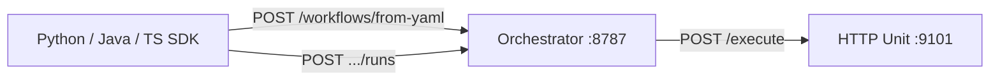

# 跨语言

Uni-Flow 的执行核（Orchestrator）为 Node HTTP 服务；任意语言实现的 Agent 只要遵守 **Remote Unit HTTP Contract**，即可通过 `bindings` 接入同一 YAML 拓扑。

## 架构概览



| 组件 | 职责 |
|------|------|
| Orchestrator | 校验 YAML、注册工作流、调度 Engine、暴露 HTTP / MCP |
| HTTP Unit | 实现 `POST` + `AgentOutput` JSON，供 `builtin.http` / bindings 调用 |
| SDK | 调用 Orchestrator REST；本地可做 YAML Schema 校验 |

## 三步跑通

详细步骤与命令见仓库 [`examples/cross-lang/README.md`](https://github.com/CoderYc0923/Uni-Flow/blob/main/examples/cross-lang/README.md)。

### 1. 启动 Orchestrator

```bash
npm run build
npx tsx examples/cross-lang/ts/start-orch-only.ts
```

默认监听 `http://127.0.0.1:8787`。

### 2. 启动 HTTP Unit（greeter）

Python / Java demo 默认自启 `127.0.0.1:9101/execute`。若已有 Unit：

```bash
export SKIP_LOCAL_GREETER=1
export GREETER_URL=http://your-host:9101/execute
```

### 3. 运行 SDK Demo

| 语言 | 命令 |
|------|------|
| TypeScript | `npx tsx examples/cross-lang/ts/run-ts-demo.ts` |
| Python | `pip install -e sdk/python` 后 `python examples/cross-lang/python/run_demo.py` |
| Java | 编译后 `java -cp out io.uniflow.examples.RunDemo` |

## 环境变量

| 变量 | 默认值 | 说明 |
|------|--------|------|
| `UNIFLOW_URL` | `http://127.0.0.1:8787` | Orchestrator 基址 |
| `GREETER_PORT` | `9101` | 本地 Unit 端口 |
| `GREETER_URL` | `http://127.0.0.1:9101/execute` | bindings 中的 endpoint |
| `SKIP_LOCAL_GREETER` | 未设置 | 设为 `1` 时不自启 Unit |

## SDK 文档

- [TypeScript SDK](/reference/typescript-sdk)
- [Python SDK](/reference/python-sdk)
- [Java SDK](/reference/java-sdk)

## Remote Unit 契约

[Remote Unit HTTP Contract](https://github.com/CoderYc0923/Uni-Flow/blob/main/docs/remote-unit-http-contract.md) — 请求体含 `input` / `context`；响应为 `AgentOutput` JSON。

## Registry 内存态

Orchestrator 进程退出后，`from-yaml` 注册的工作流会从内存消失；YAML 文件仍在，重启后需重新注册。

## 示例页

- [跨语言示例](/examples/cross-lang)
