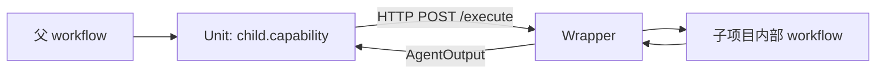

# 跨项目复用

当你有两个（或更多）独立项目——例如 **RAG（TS）** 与 **智能客服（Python/Java）**——希望共用同一套编排规范，并把 RAG **当成客服工作流里的一个 Unit**，用这一页。

跨语言只是边界上的常见结果，不是目标本身。多语言 SDK / greeter 演示见 [跨语言（手段）](/guide/cross-lang)。

## 你要的双视图

| 视角 | 形态 |
|------|------|
| **子项目对内** | 完整 Uni-Flow workflow（自己的 YAML / Engine / 部署） |
| **父项目对外** | 一个标准 Unit：`AgentInput` → `AgentOutput` |

推荐模式名：**Workflow-as-Unit**——Wrapper 收 `POST /execute`，内部跑完整子 workflow，再压成一次 Unit 输出。



仓库最小示例：[`examples/workflow-as-unit/`](https://github.com/CoderYc0923/Uni-Flow/tree/main/examples/workflow-as-unit)。

## 四条控制通道（别混用）

| 通道 | 管什么 | 示例 |
|------|--------|------|
| ControlFlow / YAML | 拓扑：跑谁、顺序、分支 | Sequential / Router |
| `policyOverrides` | 超时、重试、预算、熔断 | `timeout.unitMs` |
| `contextPolicy` | Layer4 记忆/上下文装配 | 拉哪些 session 记忆 |
| **`AgentInput.params`** | 父级传给子 capability 的**业务策略** | `topK`、`retrievalMode` |

**优先级：** 运行时 `params` > `unit.config` 默认值 > 子服务内部默认。  
**禁止：** 在 `params` 里放密钥；密钥走 bindings headers / secrets。

### `params` 与 capability profile

Engine **只透传** `params`（`Record<string, unknown>`），不解析 RAG/客服语义。文档约定可用：

```json
{
  "task": "用户问：退款多久到账？",
  "params": {
    "$profile": "rag.v1",
    "retrievalMode": "fast",
    "topK": 5
  }
}
```

| 约定 | 说明 |
|------|------|
| `$profile` | 如 `rag.v1`；由 Wrapper/插件解释 |
| 版本 | 破坏性变更升 major（`v2`） |
| 未知字段 | 建议忽略 |
| 输出 | 稳定键可放 `AgentOutput.metadata`（如 `route`、`citations`）供父级消费 |

## 组合主路径 vs 旁路

| 路径 | 用途 |
|------|------|
| **Unit `/execute`（主）** | 父 ControlFlow 嵌入子能力；走 HttpAdapter / bindings |
| Orchestrator `POST /workflows/:id/runs`（旁路） | 独立触发、调试、批处理完整 workflow |

父级超时/重试仍由父级 `policyOverrides` 管外层；子内部步骤自治——父级**不**下发子节点级路由。

## 接入步骤（最短）

1. 子项目实现内部 YAML，并写 Wrapper：`/execute` → `createEngineFromYaml` → `run` → `AgentOutput`。
2. 父项目 YAML：`uses: child.capability`（或你的名字）。
3. `from-yaml` 时 bindings：`{ "child.capability": { "type": "http", "endpoint": "http://.../execute" } }`。
4. `startWorkflow` 传入 `{ task, params }`。

详见 [uses 与插件](/guide/uses) 与 [Remote Unit 契约](https://github.com/CoderYc0923/Uni-Flow/blob/main/docs/remote-unit-http-contract.md)。

## 与「跨语言」的关系

- **目标：** 跨项目复用同一编排契约。  
- **手段：** 各项目用本语言 SDK；跨部署用 HTTP Unit（恰好可跨语言）。  
- **不要：** 为了炫技在同一工作流里故意混用多种语言子 Agent。

## 若你只记住一件事

**子项目对内完整 workflow，对父级只是一个 Unit；业务旋钮走 `params`，拓扑仍在 YAML。**
