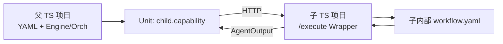

# 跨项目复用（TS↔TS）

**主路径（近期）：** 两个 **TypeScript** 项目共用 Uni-Flow——子项目对内跑完整 workflow，对外暴露 `POST /execute`；父项目 YAML 用 bindings 把它当成**一个 Unit**。



::: tip 能力边界
**完整进程内 Engine 目前只有 TypeScript。** Python / Java 可做 HTTP SDK 或远程 Unit，但不能在本语言进程内跑完整 Uni-Flow ControlFlow（Engine 移植为远期）。
:::

仓库示范（单仓模拟两部署）：[`examples/workflow-as-unit/`](https://github.com/CoderYc0923/Uni-Flow/tree/main/examples/workflow-as-unit)。

## 跟做：TS 父 + TS 子

### 1. 子项目（部署 B）

1. 依赖 `uni-flow`，编写内部 `child-internal.workflow.yaml`。
2. 暴露 execute（可用包内助手）：

```typescript
import { createServer } from 'node:http';
import { createWorkflowAsUnitHttpHandler } from 'uni-flow';

const handler = createWorkflowAsUnitHttpHandler(yamlText, {
  contentStateKey: 'output.answer', // 映射主输出
});
createServer(handler).listen(9201);
```

契约：[Remote Unit HTTP Contract](https://github.com/CoderYc0923/Uni-Flow/blob/main/docs/remote-unit-http-contract.md)（含可选 `input.params`）。

### 2. 父项目（部署 A）

父 YAML 只声明一个远程能力：

```yaml
# parent.workflow.yaml
spec:
  units:
    - id: child
      uses: child.capability
  flow:
    type: sequential
    order: [child]
```

注册 bindings（endpoint 指向子 `/execute`）：

```typescript
await client.loadAndRegister(parentYaml, {
  'child.capability': {
    type: 'http',
    endpoint: 'http://127.0.0.1:9201/execute',
  },
});
await client.startWorkflow('parent-embeds-child', {
  task: 'refund timing',
  params: { $profile: 'rag.v1', mode: 'fast', topK: 5 },
}, { sync: true });
```

父也可用**进程内** `createEngineFromYaml` + `bindings`，不一定启 Orchestrator。

### 3. 一键跑通本仓 demo

```bash
npx vitest run tests/workflow-as-unit-demo.test.ts
# 或
npx tsx examples/workflow-as-unit/ts/run-demo.ts
```

## 双视图

| 视角 | 形态 |
|------|------|
| **子对内** | 完整 Uni-Flow workflow（YAML + Engine） |
| **父对外** | 标准 `AgentInput` → `AgentOutput` |

## 四条控制通道

| 通道 | 管什么 |
|------|--------|
| ControlFlow / YAML | 拓扑 |
| `policyOverrides` | 超时 / 重试 / 预算 |
| `contextPolicy` | Layer4 上下文装配 |
| **`AgentInput.params`** | 父→子业务策略（如 `topK`） |

优先级：`params` > `unit.config` 默认 > 子内部默认。  
**禁止** 在 `params` 放密钥。

### `params` / `$profile`

```json
{
  "task": "...",
  "params": { "$profile": "rag.v1", "retrievalMode": "fast", "topK": 5 }
}
```

Engine **只透传**；领域语义由子 Wrapper / 插件解释。

## 组合主路径 vs 旁路

| 路径 | 用途 |
|------|------|
| **Unit `/execute`** | 父图嵌入子能力（主） |
| Orchestrator `.../runs` | 独立跑完整 workflow（旁路） |

## 与跨语言

跨语言只是「HTTP 边界」的副产品。近期请先跑通 **TS↔TS**。多语言 SDK 演示见 [跨语言（手段）](/guide/cross-lang)，勿理解为「Py/Java 已有完整 Engine」。

## 若你只记住一件事

**两个 TS 项目：子对内完整 Uni-Flow，对外 `/execute`；父 YAML 只认一个 Unit + `params`。**
