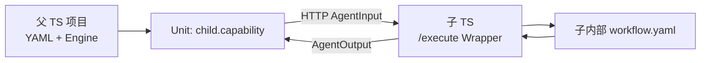

# 跨项目复用（TS↔TS）

本页假设你已能在**单个** TS 项目里用 YAML + `createEngineFromYaml` 跑通 Mock（见 [快速开始](/guide/quickstart)、[YAML](/guide/yaml)）。  
现在把「另一个 TS 服务」嵌进父工作流，变成**一个 Unit**。

## 你将完成什么

1. 理解：子项目对内跑完整 workflow，对外只暴露 `POST /execute`  
2. 父 YAML 只声明一个远程 `uses`，用 bindings 指向子的 `/execute`  
3. （本仓）按步骤跑通 demo，或看清 vitest 在验什么  



::: tip 能力边界
**完整进程内 Engine 目前只有 TypeScript。**  
Python / Java 可做 HTTP SDK 或远程 Unit，**不能**在本语言进程内跑完整 Uni-Flow ControlFlow（Engine 移植为远期）。请先跑通 **TS↔TS**。
:::

规范示范（一仓模拟两个部署）：[`examples/workflow-as-unit/`](https://github.com/CoderYc0923/Uni-Flow/tree/main/examples/workflow-as-unit)。

---

## 跟做概览

| 角色 | 做什么 | 本仓对应 |
|------|--------|----------|
| **子（部署 B）** | HTTP 服务，收到 `AgentInput` → 跑内部 YAML → 返回 `AgentOutput` | `examples/workflow-as-unit/ts/child-execute-server.ts`，端口常为 `9201` |
| **父（部署 A）** | YAML 里一个 Unit + bindings 指向子 `/execute` | parent YAML + `run-demo.ts` / Orchestrator |

HTTP 字段契约：[Remote Unit HTTP Contract](https://github.com/CoderYc0923/Uni-Flow/blob/main/docs/remote-unit-http-contract.md)（含可选 `input.params`）。

---

## 步骤 1：子项目 — 内部 workflow

子对内仍是普通 Uni-Flow YAML（Sequential / Mock 即可）。关键是跑完后能把主结果写到某个 SharedState 键（例如 `output.answer`），供 Wrapper 映射到 `AgentOutput.content`。

## 步骤 2：子项目 — 暴露 `/execute`

用包内助手（推荐，少样板代码）：

```typescript
import { createServer } from 'node:http';
import { createWorkflowAsUnitHttpHandler } from 'uni-flow';

const yamlText = `...子内部 YAML 文本或读文件...`;

const handler = createWorkflowAsUnitHttpHandler(yamlText, {
  // 把内部 state 的这个键映射为 AgentOutput.content
  contentStateKey: 'output.answer',
});

createServer(handler).listen(9201, () => {
  console.log('child /execute on http://127.0.0.1:9201/execute');
});
```

### 预期现象

- 进程不退出，监听 `9201`
- 用 curl 探活（路径以 demo 为准，一般为 `POST /execute`）：

```bash
curl -s -X POST http://127.0.0.1:9201/execute ^
  -H "content-type: application/json" ^
  -d "{\"task\":\"hello\",\"params\":{\"topK\":3}}"
```

（Linux/macOS 把 `^` 换成 `\`。）  
响应体应接近 `AgentOutput`：含 `content`、`stopReason`、`metadata` 等。

## 步骤 3：父项目 — YAML 只认一个 Unit

```yaml
apiVersion: uniflow/v1
kind: Workflow
metadata:
  id: parent-embeds-child
spec:
  units:
    - id: child
      uses: child.capability
  flow:
    type: sequential
    order: [child]
```

注意：父 YAML **不要**展开子内部的 unit id。

## 步骤 4：父项目 — bindings + 运行

**进程内（不必启 Orchestrator）：**

```typescript
import { createEngineFromYaml } from 'uni-flow';

const engine = await createEngineFromYaml('./parent.workflow.yaml', {
  bindings: {
    'child.capability': {
      type: 'http',
      endpoint: 'http://127.0.0.1:9201/execute',
    },
  },
});

const result = await engine.run({
  task: 'refund timing',
  params: { $profile: 'rag.v1', mode: 'fast', topK: 5 },
});

console.log(result.completedUnits);
console.log(result.state['output.child']);
```

**或经 Orchestrator / SDK `loadAndRegister`：** 把同一套 bindings 在注册时传入（见示例 README）。

### 预期现象

- `completedUnits` 包含 `child`
- 子服务日志出现一次 execute
- 父 `state` 中有子 Unit 的输出键（如 `output.child`）

若父报连接失败：先确认步骤 2 子进程仍在听 `9201`，endpoint 路径含 `/execute`。

## 步骤 5：本仓一键验证

在 Uni-Flow 仓库根目录：

```bash
npx vitest run --pool=forks --minWorkers=1 --maxWorkers=1 tests/workflow-as-unit-demo.test.ts
```

或：

```bash
npx tsx examples/workflow-as-unit/ts/run-demo.ts
```

按 [示例 README](https://github.com/CoderYc0923/Uni-Flow/blob/main/examples/workflow-as-unit/README.md) 启动顺序：通常**先子后父**。

### 预期现象

- 测试通过 / demo 打印成功 run 摘要（`runId`、`status`、`completedUnits` 等）

---

## 双视图（帮助记忆）

| 视角 | 形态 |
|------|------|
| **子对内** | 完整 Uni-Flow workflow（YAML + Engine） |
| **父眼里的子** | 标准 `AgentInput` → `AgentOutput` 的一个 Unit |

## 四条控制通道

| 通道 | 管什么 |
|------|--------|
| ControlFlow / YAML | 谁先谁后、有哪些 Unit |
| `policyOverrides` | 超时 / 重试 / 预算 |
| `contextPolicy` | Layer4 上下文装配 |
| **`AgentInput.params`** | 父→子业务旋钮（如 `topK`） |

优先级：`params` > `unit.config` 默认 > 子内部默认。  
**禁止**在 `params` 里放密钥。

```json
{
  "task": "...",
  "params": { "$profile": "rag.v1", "retrievalMode": "fast", "topK": 5 }
}
```

Engine **只透传** `params`；领域含义由子 Wrapper / 插件解释。

## 组合主路径 vs 旁路

| 路径 | 用途 |
|------|------|
| **Unit `/execute`** | 父图嵌入子能力（**主路径**） |
| Orchestrator `.../runs` | 独立跑完整 workflow（调试/批跑旁路） |

## 与跨语言

跨语言只是 HTTP 边界的副产品。近期请先跑通 **TS↔TS**。多语言 SDK 演示见 [跨语言（手段）](/guide/cross-lang)，勿理解为「Py/Java 已有完整 Engine」。

## 常见问题

| 现象 | 处理 |
|------|------|
| 父 `uses` 解析失败 | bindings 的 key 必须与 YAML `uses` 字符串完全一致 |
| 子返回了但父 state 为空 | 检查 `contentStateKey` / outputAdapter 是否写出约定键 |
| 想复制 Wrapper | 优先 `createWorkflowAsUnitHttpHandler` / `runWorkflowAsUnit`（见 [YAML API](/reference/yaml-api)） |

## 若你只记住一件事

**两个 TS 项目：子对内完整 Uni-Flow、对外 `/execute`；父 YAML 只认一个 Unit，业务旋钮走 `params`。**
