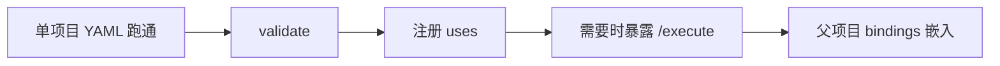

# 诉求与 3W

Uni-Flow 不是又一个 Prompt 模板库，也不是某个大模型的封装。它回答的是：**当多个项目、多条业务链路都需要编排 Agent / 能力时，用什么统一的排班规范；以及把另一个项目的能力接进来时，边界在哪里。**

## 一张表看懂 3W

| 维度 | 内容 |
|------|------|
| **Who（为谁）** | 需要把多 Agent / 多能力拓扑做成**可声明、可校验、可跨项目复用**的团队：平台组、AI 应用组、要把 RAG 等能力嵌进客服等业务工作流的后端团队，以及用 Cursor 等工具改 YAML 的编码 Agent。 |
| **Why（为何）** | 手写 `for`/`while` 排多个 Agent、或每个仓库自造调度器，会导致拓扑与业务纠缠、难复用。跨项目时若只能拷源码或绑死同一语言运行时，复用成本更高。Uni-Flow 把**宏观排班**（ControlFlow）与**微观执行**（Unit）拆开，并用标准输入输出让「子项目对内是完整 workflow、对外是一个 Unit」。 |
| **How（怎么上手）** | 1）本项目用 YAML 描述 `units` + `flow`；2）用本语言 SDK / `uses` 注册插件；3）`uniflow validate`；4）需要复用时，对方暴露 `/execute`（Workflow-as-Unit），父级用 bindings 接入。详见 [快速开始](/guide/quickstart) 与 [跨项目复用](/guide/cross-project)。 |

## 叙事：从痛点到结构

### 痛点：编排散在业务代码里，复用靠拷贝

常见乱法：

1. **单 Prompt 包办一切**——判路由、调工具、生成回复全塞进一段 system prompt。
2. **项目内自造调度器**——每个仓库一套 `if` / `Promise.all` / 状态机语义。
3. **跨项目只能拷仓或同语言进程内 import**——客服要调 RAG，却没有稳定的 Unit 契约。

### 解法：两层正交 + 跨项目 Unit 边界

```text
一次工作流运行
  └── ControlFlow（宏观：下一个执行哪些 Unit）
        └── 每个 WorkflowUnit（微观：Adapter 执行；可为远程项目）
```

- **Router** 等 ControlFlow 负责「下一个跑谁」。
- **领域 Unit** 只关心输入输出契约；远程时走 HTTP Unit。
- **跨项目**：子项目内部仍可是完整 Uni-Flow workflow；对父级只暴露标准 `AgentInput` → `AgentOutput`（见 [跨项目复用](/guide/cross-project)）。

### 边界：Uni-Flow 不做什么

| 不做 | 你做 |
|------|------|
| 替你选大模型、写业务 SQL | 在 Adapter / `uses` 插件里实现 |
| 替代 LangGraph / Mastra 等应用内框架 | 把它们包进一个 Unit（见 [框架对比](/why/vs-frameworks)） |
| 内置完整行业方案 | 用 YAML 画拓扑 + 插件或远程 Unit 接领域能力 |

## 典型采纳路径



1. **先跑通一个项目** — [快速开始](/guide/quickstart)。
2. **再理解结构** — [两层模型](/architecture/model)。
3. **跨项目复用** — [跨项目复用](/guide/cross-project) 与 `examples/workflow-as-unit/`。
4. **生产横切** — Layer4（预算、HITL、Checkpoint）按需接入。

## 若你只记住一件事

**YAML 画排班，Unit 干领域活（可本地可远程），跨项目靠标准输入输出，不靠同语言同仓。**
