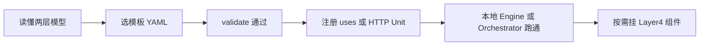

# 诉求与 3W

Uni-Flow 不是又一个 Prompt 模板库，也不是某个大模型的封装。它回答的是：**当一条业务链路需要多个 Agent 协作时，谁来决定「下一个跑谁」，以及这些横切能力（预算、安全、记忆、断点）放在哪里。**

## 一张表看懂 3W

| 维度 | 内容 |
|------|------|
| **Who（为谁）** | 需要把多 Agent 拓扑做成**可声明、可校验、可复用**的团队：平台组、AI 应用组、需要跨语言协作的后端团队，以及用 Cursor 等工具改 YAML 的编码 Agent。 |
| **Why（为何）** | 手写 `for`/`while` 排多个 Agent、或把路由逻辑塞进单个巨型 Prompt，会导致拓扑与业务代码纠缠、难测、难加硬规则。Uni-Flow 把**宏观排班**（ControlFlow）与**微观执行**（Unit/Adapter）拆开，并用统一管线承载生产横切。 |
| **How（怎么上手）** | 1）用 Workflow YAML 描述 `units` + `flow`；2）用 `uses` 注册领域插件或 HTTP Unit；3）`uniflow validate` 校验；4）`createEngineFromYaml` 或 Orchestrator 启动。详见 [快速开始](/guide/quickstart)。 |

## 叙事：从痛点到结构

### 痛点：编排散在业务代码里

常见两种乱法：

1. **单 Prompt 包办一切**——判路由、调工具、生成回复全塞进一段 system prompt。意图一多就难测，也难加「某类操作必须走工具」这类硬约束。
2. **项目内自造调度器**——`if route === 'x'`、手写并行 `Promise.all`、自己维护状态机。每个仓库一套语义，和模型/SDK 升级缠在一起。

### 解法：两层正交

```text
一次工作流运行
  └── ControlFlow（宏观：下一个执行哪些 Unit）
        └── 每个 WorkflowUnit（微观：Adapter 执行一次或内部循环）
```

- **Router** 负责「根据上游输出选哪条支路」——这是 ControlFlow 层的条件分支，不是某个 Unit 里的隐藏 `if`。
- **领域 Unit** 只关心自己的输入输出契约，通过 `inputAdapter` / `outputAdapter` 与 SharedState 对话。
- **引擎** 在每次 Unit 执行前后走同一套管线（Policy → Security → Context → …），见 [执行管线](/architecture/pipeline)。

### 边界：Uni-Flow 不做什么

| 不做 | 你做 |
|------|------|
| 替你选大模型、写业务 SQL | 在 Adapter / `uses` 插件里实现 |
| 替代 LangGraph 等图编排框架 | 把 LangGraph 包进一个 Unit（见 [框架对比](/why/vs-frameworks)） |
| 内置完整行业方案 | 用 YAML 画拓扑 + 插件接领域能力 |

## 典型采纳路径



1. **先懂结构** — [两层模型](/architecture/model) 与 [模式抗性](/why/resilience)。
2. **再动配置** — 从 `examples/templates/` 改一份 YAML，`npx uniflow validate`。
3. **后接真智能** — Mock Adapter 验证拓扑后，换成真实 `uses` 或远程 Unit。
4. **最后上生产横切** — Token 预算、HITL、Checkpoint 等通过 Layer4 显式接入。

## 若你只记住一件事

**YAML 画排班，插件干领域活，引擎按同一管线执行。** 编排是基础设施，不是 Prompt 技巧。
