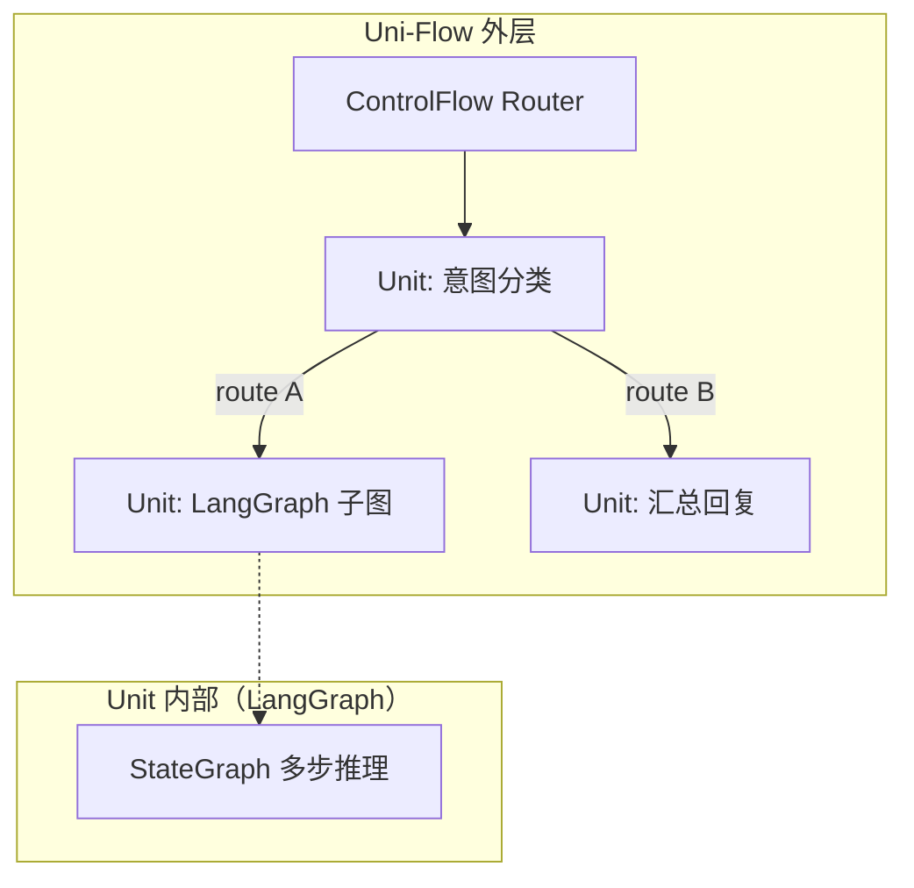

# 与成熟框架对比

选型时常见疑问：「已有 LangGraph / LangChain，还要 Uni-Flow 吗？」本文用**共性、差异、互补**三段式回答，并给出可操作的组合方式。

## 共性：都是「节点 + 边」

| 框架 | 编排隐喻 | 典型能力 |
|------|----------|----------|
| **LangGraph** | 有向图上的节点与边 | 状态图、条件边、子图、checkpoint |
| **LangChain** | Chain / Runnable 组合 | LCEL、工具绑定、检索链 |
| **手写 for 循环** | 代码即调度器 | 灵活，但语义不统一 |
| **Uni-Flow** | ControlFlow + WorkflowUnit | YAML 拓扑、七种流、统一 Layer4 管线 |

它们都在解决：**多个步骤按某种顺序或条件执行，并在步骤之间传递状态。**

## 差异：Uni-Flow 多出来的那一层

| 维度 | LangGraph / 手写循环 | Uni-Flow |
|------|----------------------|----------|
| **拓扑声明** | 多在代码里构图 | Workflow YAML + JSON Schema 校验 |
| **宏观流类型** | 自行建模 | Sequential / Parallel / Router / DAG / Loop / Delegation / Composite |
| **运行时绑定** | 通常与 Python/TS 图代码一体 | Unit 通过 RuntimeAdapter 解耦；可 HTTP 远程 |
| **横切管线** | 需自行拼装 | Policy / Security / Context / Checkpoint / Obs 内置顺序 |
| **跨语言** | 以单语言运行时为主 | Orchestrator + 远程 Unit 契约 |
| **人与 AI 协作** | 改代码为主 | 改 YAML + `uniflow validate` 可机器校验 |

Uni-Flow **不是**在模型调用、工具定义、向量检索上替代 LangChain；**也不是**在图算法表达力上完全取代 LangGraph。

## 手写 for 循环：为什么不够

```typescript
// 反模式：业务仓库里的第二套调度器
for (const agent of agents) {
  const out = await agent.run(state);
  if (out.route === 'specialist') { /* 手写分支 */ }
}
```

问题不在于 `for` 能不能跑，而在于：

- 拓扑语义**不可声明、不可校验**，每个项目一套；
- 预算、鉴权、checkpoint 容易**复制粘贴**进循环体；
- 编码 Agent 无法稳定地「只改 YAML」而不碰调度代码。

Uni-Flow 把循环语义收进 `ControlFlow` 实现（如 `LoopFlow`），外层只认 `next()` / `isComplete()` 接口。

## LangGraph：互补，而非替代

**结论（请先读这句）：Uni-Flow 不替换 LangGraph；LangGraph 可以作为单个 WorkflowUnit 的内部运行时。**



| 场景 | 建议 |
|------|------|
| 单语言、单图、团队已深度投入 LangGraph | 继续用 LangGraph；需要 YAML 契约与横切管线时再引入 Uni-Flow 包一层 |
| 多团队、多语言、拓扑要进仓库可 diff | Uni-Flow YAML 为真源；LangGraph 跑在某一 Unit 里 |
| 只要链式 LLM 调用 | LangChain/LCEL 可能更轻；不必强行上 ControlFlow |

**Unit Wrapper 模式：** 实现一个 `RuntimeAdapter`，在 `execute()` 内调用 LangGraph 的 `invoke` / `stream`，把 `AgentInput` 映射为图状态，把图输出映射为 `AgentOutput`。外层 Router、预算、HITL 仍由 Uni-Flow 引擎管线负责。

## LangChain：不同层次的问题

LangChain 擅长**单次调用链**（模型 + 工具 + 检索）。Uni-Flow 擅长**多 Unit 宏观拓扑**与**生产横切**。

合理分工：

- LangChain 工具、Retriever、Prompt 模板 → 留在 Unit 内部；
- 哪个 Unit 何时执行、并行还是路由 → Workflow YAML + ControlFlow。

## 选型速查

| 你的主要矛盾 | 优先考虑 |
|--------------|----------|
| 图编排、子图、条件边已在 LangGraph 里很成熟 | LangGraph 为主；Uni-Flow 作外层标准壳 |
| 拓扑要给人和 AI 共用、要 validate | Uni-Flow YAML |
| 只有 2～3 步固定顺序 | Sequential YAML 或简单 Chain 均可 |
| 跨语言 Unit、统一 HTTP 运维 | Uni-Flow Orchestrator |

## 若你只记住一件事

**Uni-Flow 管宏观编排与统一管线；LangGraph 等框架可以装进 Unit。** 二者是套娃关系，不是零和替代。
